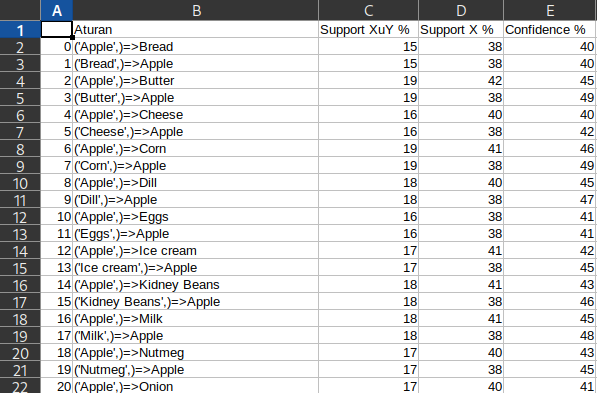

# Association Rule

## install :

```bash
pip3 install pandas
pip3 install numpy
pip3 install itertools
git clone https://github.com/syahrolus/data_mining.git
# cd data_mining/association_rule_apriori
```

thanks to https://www.kaggle.com/ahmtcnbs/datasets-for-appiori for the dataset

## description:

1. `basket_analysis.csv`


2. `ar_apriori.py`, main program
3. `hasil_akhir.csv`, result prediction

## running:

```bash
python3 ar_apriori.py
``` 
## result:


hasil_akhir.csv


