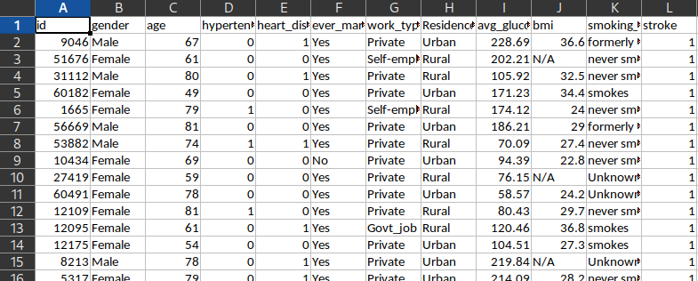
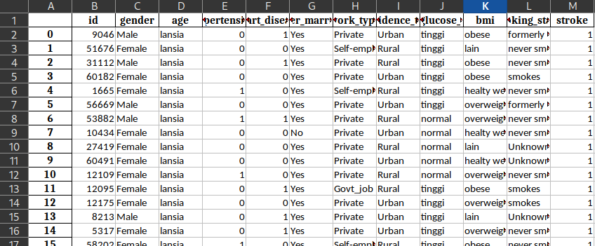
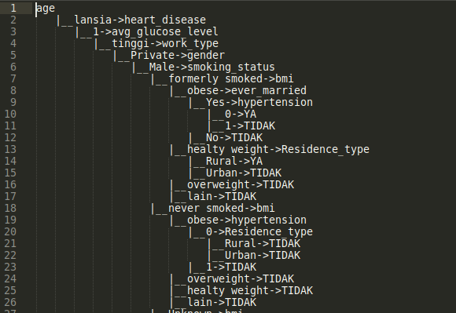
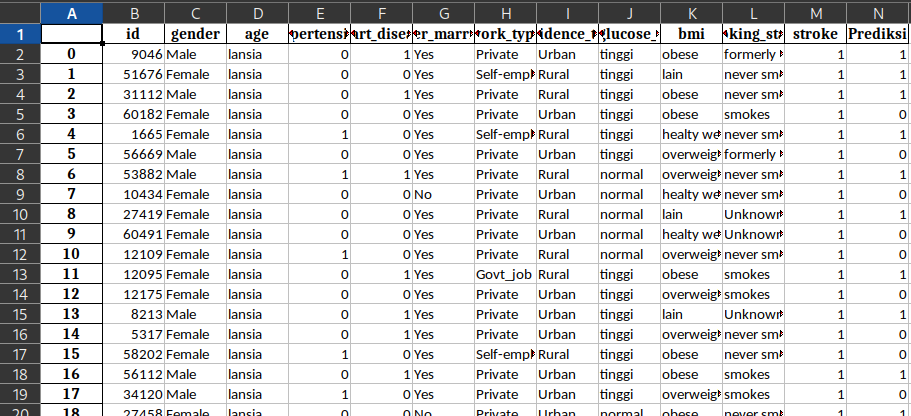
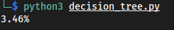

# Decision Tree

## install :

```bash
pip install pandas
pip install numpy
git clone https://github.com/syahrolus/data_mining.git
# cd data_mining/decision_tree
```

thanks to https://www.kaggle.com/fedesoriano/stroke-prediction-dataset for the dataset

## description:

1. `healthcare-dataset-stroke-data.csv` & `healthcare-dataset-stroke-data.xlsx`, dataset (both are same, just differ in extension)



2. `klasifikasi.py`, you must change according to your need for better proccess
3. `stroke_classified.xlsx`, result after running the `klasifikasi.py` , This file will be used for the main program



> `age` (anak, remaka, dewasa, lansia) , based on the classification of the Indonesian Ministry of Health
> `avg_glucose_level`, based on the internet and my friends who study majoring in medicine
> `bmi`, based on the internet

4. `decision_tree.py`, main program, __!important__ you have to make sure that your first column is id/name/unique/'any unique key' and last column is result(in this case is stroke)
5. `decision_tree.txt`, decisions after running the main program, just to illustrate for better understanding
6. `hasil_prediksi.xlsx`, result prediction
7. `tmp.xlsx`, just a temporary need, you can delete it

## running:

1. first, you have to make sure to classify your attributes first (you can use `klasifikasi.py` and change them according to your needs), and change NaN (if any) to `other` attributes or other names manually.
2. 
```bash
python3 klasifikasi.py
``` 
3. 
```bash 
python3 decision_tree.py
```

## result:

decision_tree.txt if you uncomment some comments in the main program (`decision_tree.py`)



hasil_prediksi.xlsx



Error Calculating

